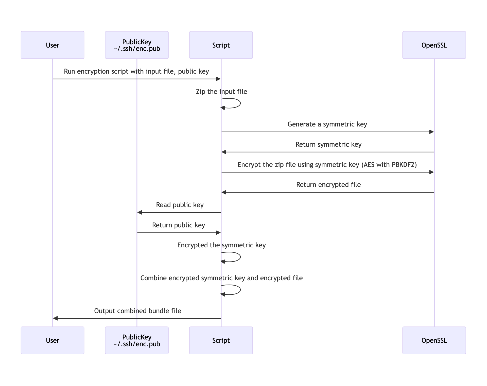
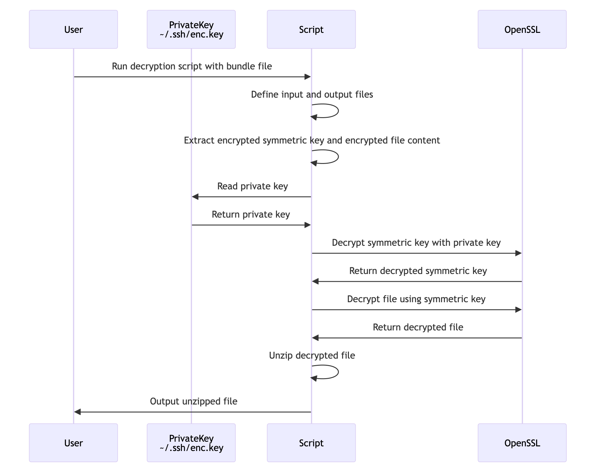

# MiniGPG: Simple GPG-like Encryption with OpenSSL
GPG (GNU Privacy Guard) encryption is a cryptographic tool used for secure communication and data encryption. It implements the OpenPGP standard for encrypting and signing data and communications. GPG uses a combination of symmetric-key cryptography for speed and public-key cryptography for secure key exchange. Users create a pair of keys: a public key, which is shared, and a private key, which is kept secret. Data encrypted with the public key can only be decrypted with the corresponding private key, ensuring confidentiality and authenticity.

MiniGPG is a simplified implementation inspired by GPG encryption, designed for educational purposes. It leverages OpenSSL to perform cryptographic operations and provides an easy-to-understand framework for learning about encryption and decryption processes. While MiniGPG can effectively demonstrate these principles, it may require additional development and security enhancements for use in production environments.


### Preparation Process:
1. Create a public-private RSA key pair.

**Generate Private Key:**
```bash
openssl genpkey -algorithm RSA -out encryption.key -aes256 -pass pass:your_password
or
openssl genpkey -algorithm RSA -out encryption.key
```

**Generate Public Key:**
```bash
openssl rsa -pubout -in encryption.key -out encryption.pub -passin pass:your_password
or
openssl rsa -pubout -in encryption.key -out encryption.pub
```


### Encryption Process:
1. Generate a symmetric key to encrypt a file.
2. Zip the file before encryption with the symmetric key.
3. Encrypt the zipped file using the symmetric key.
4. Encrypt the symmetric key with the RSA public key.
5. Attach the encrypted symmetric key to the encrypted file.

### Decryption Process:
1. Split the encrypted symmetric key from the encrypted file (the bundle file).
2. Decrypt the symmetric key using the RSA private key.
3. Decrypt the encrypted file using the decrypted symmetric key.
4. Unzip the decrypted file.

## Prerequisites

Ensure you have OpenSSL installed on your system. You can install it using:

```sh
sudo apt-get install openssl
```

## Scripts

### 1. encrypt.sh

This script performs the following steps:
- Creates an RSA public-private key pair (if not already created).
- Generates a symmetric key.
- Zips the given file.
- Encrypts the zipped file using the symmetric key.
- Encrypts the symmetric key with the RSA public key.
- Outputs the encrypted file and the encrypted symmetric key.



#### Usage

```sh
./encrypt.sh input_file output_file
```

### 2. decrypt.sh

This script performs the following steps:
- Splits the encrypted symmetric key from the encrypted file (the bundle file).
- Decrypts the symmetric key using the RSA private key.
- Decrypts the encrypted file using the decrypted symmetric key.
- Unzips the decrypted file.


#### Usage

```sh
./decrypt.sh encrypted_file encrypted_key output_file
```

## How to Use

1. Clone the repository:
```sh
git clone https://github.com/yourusername/minigpg.git
cd minigpg
```

2. Make the scripts executable:
```sh
chmod +x encrypt.sh decrypt.sh
```

3. Run the encryption script:
```sh
./encrypt.sh path/to/input_file path/to/output_file
```

4. Run the decryption script:
```sh
./decrypt.sh path/to/encrypted_file path/to/encrypted_key path/to/decrypted_output_file
```

## License

This project is licensed under the MIT License. See the [LICENSE](LICENSE) file for details.


<!-- 

sequenceDiagram

    participant User
    participant PublicKey as PublicKey<br>~/.ssh/enc.pub
    participant Script
    participant OpenSSL

    User->>Script: Run encryption script with input file, public key
    Script->>Script: Zip the input file
    Script->>OpenSSL: Generate a symmetric key
    OpenSSL->>Script: Return symmetric key
    Script->>OpenSSL: Encrypt the zip file using symmetric key (AES with PBKDF2)
    OpenSSL->>Script: Return encrypted file
    Script->>PublicKey: Read public key
    PublicKey->>Script: Return public key
    Script->>Script: Encrypted the symmetric key
    Script->>Script: Combine encrypted symmetric key and encrypted file
    Script->>User: Output combined bundle file

-->

<!--
sequenceDiagram
    participant User
    participant PrivateKey as PrivateKey<br>~/.ssh/enc.key
    participant Script
    participant OpenSSL

    User->>Script: Run decryption script with bundle file
    Script->>Script: Define input and output files
    Script->>Script: Extract encrypted symmetric key and encrypted file content
    Script->>PrivateKey: Read private key
    PrivateKey->>Script: Return private key
    Script->>OpenSSL: Decrypt symmetric key with private key
    OpenSSL->>Script: Return decrypted symmetric key
    Script->>OpenSSL: Decrypt file using symmetric key 
    OpenSSL->>Script: Return decrypted file
    Script->>Script: Unzip decrypted file
    Script->>User: Output unzipped file
-->


